# Практика с SELinux. Домашнее задание

## Задание 1. Запустить nginx на нестандартном порту 3-мя разными способами

Для выполнения задания будем использовать almalinux/9 версии 9.4.20240805 (Vagrentfile в папке task_1)

```bash
vagrant init almalinux/9 --box-version 9.4.20240805
```

```bash
vagrant up
```

```bash
vagrant ssh
```

Действия выполняем под root

```bash
sudo su
```

Для работы с SElinux Установим необходимые пакеты

```bash
yum install -y setroubleshoot-server selinux-policy-mls setools-console policycoreutils-newrole policycoreutils-python-utils
```

```bash
dnf -y install setroubleshoot-server
```

Для выполнения задания установим nginx

```bash
yum install -y nginx
```

Проверим режим работы SELinux

```bash
getenforce
```


### Способ 1. Переключатели setsebool

После установки проверим файл настроек и запустим nginx

```bash
nginx -t && systemctl start nginx.service
```

Убедимся что nginx запустился

```bash
systemctl status nginx.service
```

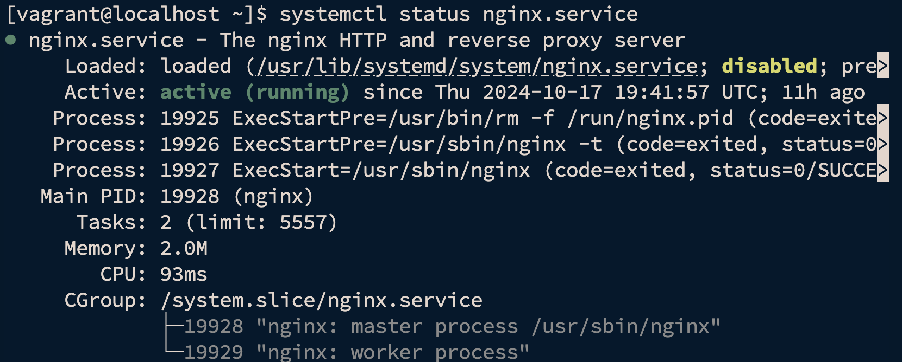

Изменим порт и отключим IPv6

```bash
vi /etc/nginx/nginx.conf
```


Проверим файл настроек и перезапустим nginx

```bash
nginx -t && systemctl restart nginx.service
```

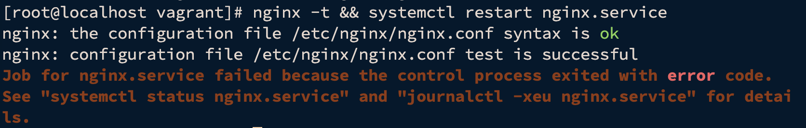

Настройки корректны, но nginx не запустился

Находим в логах (/var/log/audit/audit.log) информацию о блокировании порта

```bash
cat /var/log/audit/audit.log | grep type=AVC
```

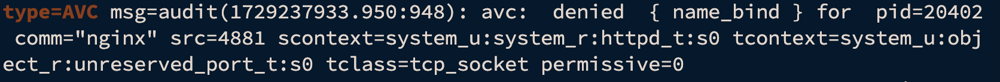

Копируем время, в которое был записан этот лог, и, с помощью утилиты audit2why смотрим причину

```bash
grep 1729236508.383:910 /var/log/audit/audit.log | audit2why
```

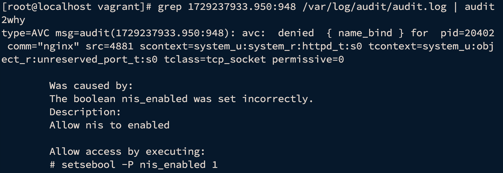

Исходя из вывода утилиты, мы видим, что нам нужно поменять параметр nis_enabled. Выыод команды пустой, возможно прошло успешно. Проверим

```
nginx -t && systemctl restart nginx.service
```


```
systemctl status nginx.service
```
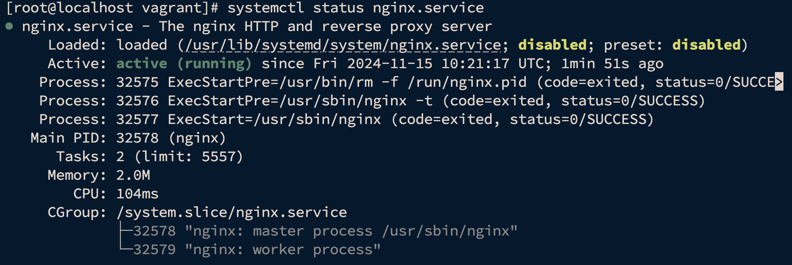

Проверим с помощью curl

```
curl localhost:4881
```
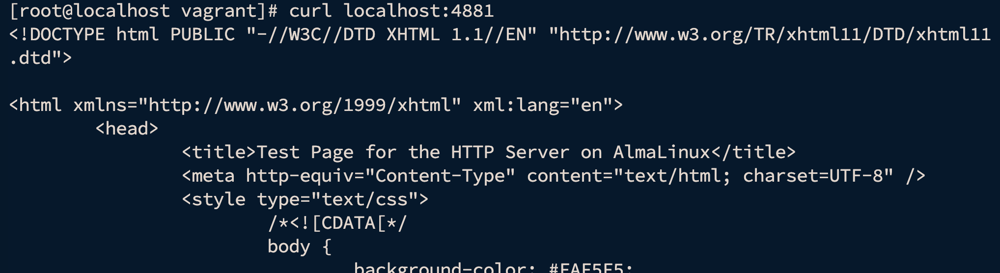

Проверить статус параметра можно с помощью команды
```
getsebool -a | grep nis_enabled
```
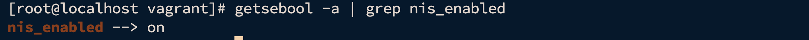

Вернём запрет работы nginx на порту 4881 обратно. Для этого отключим nis_enabled
```
setsebool -P nis_enabled off
```
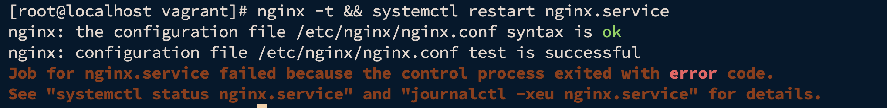

После отключения nis_enabled служба nginx снова не запустилась.

### Способ 2. добавление нестандартного порта в имеющийся тип
Поиск имеющегося типа, для http трафика
```
semanage port -l | grep http
```
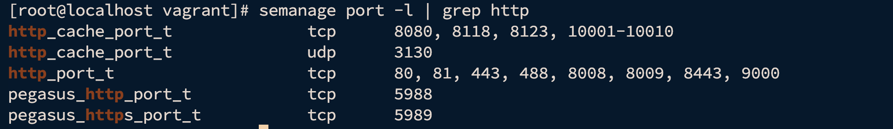

Добавим порт в тип http_port_t (если все успешно, вывод комманды пустой)
```
semanage port -a -t http_port_t -p tcp 4881
```
Проверим, что порт добавлен
```
semanage port -l | grep  http_port_t
```


Перезапустим nginx
```
nginx -t && systemctl restart nginx.service
```
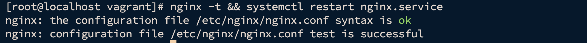

Убедимся, что служба запущена
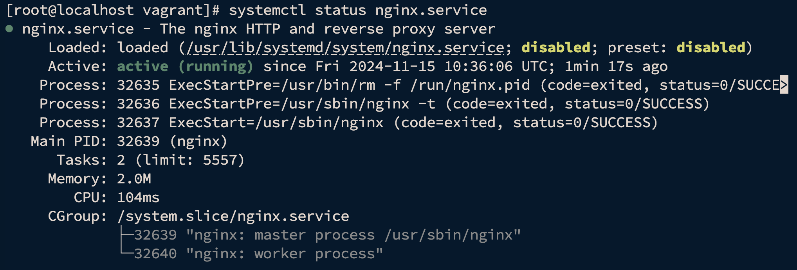

Удалить нестандартный порт из имеющегося типа можно с помощью команды
```
semanage port -d -t http_port_t -p tcp 4881
```
Перезапуск завершится с ошибкой
```
nginx -t && systemctl restart nginx.service
```
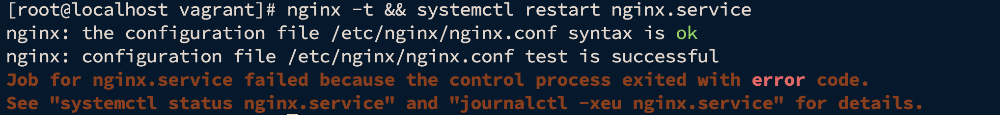

### Способ 3. формирование и установка модуля SELinux.

Попробуем запустить nginx

```
systemctl start nginx.service
```

Посмотрим логи SELinux, которые относятся к nginx

```
grep nginx /var/log/audit/audit.log
```
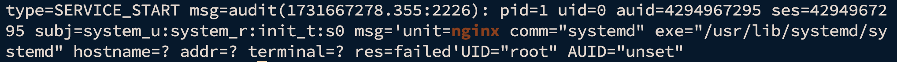

Воспользуемся утилитой audit2allow для того, чтобы на основе логов SELinux сделать модуль, разрешающий работу nginx на нестандартном порту

```
grep nginx /var/log/audit/audit.log | audit2allow -M nginx
```
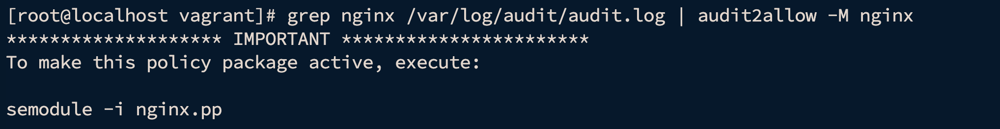

Audit2allow сформировал модуль, и сообщил нам команду, с помощью которой можно применить данный модуль

```
semodule -i nginx.pp
```
После выполнения комманды попробуем снова запустить nginx

```
systemctl start nginx.service
```
Проверим
```
systemctl status nginx.service
```
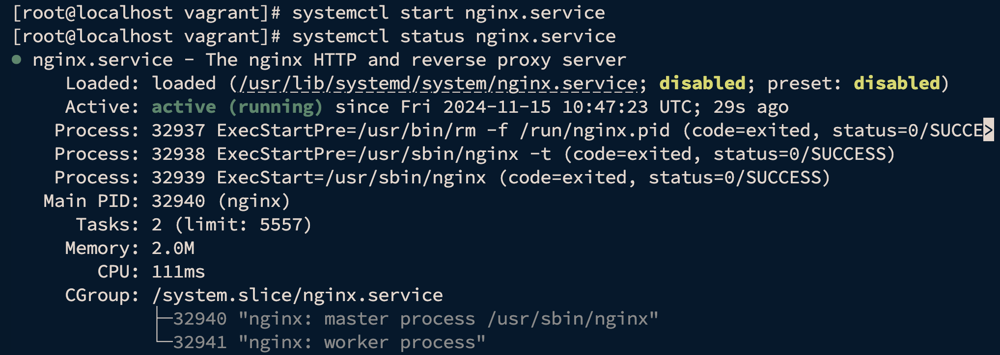

Просмотр всех установленных модулей
```
semodule -l
```

Для удаления модуля воспользуемся командой
```
semodule -r nginx
```

## Задание 2. Обеспечить работоспособность приложения при включенном selinux

Развернем предложенный стенд
```
git clone https://github.com/mbfx/otus-linux-adm.git
```

```
cd otus-linux-adm/selinux_dns_problems/
```
Развернём 2 ВМ с помощью vagrant. Для доступа вм centos7 к репозиториям дополним Vagrantfile

```
  config.vm.provision "changing repo", type: "shell", inline: "repo_file=/etc/yum.repos.d/CentOS-Base.repo; cp ${repo_file} ~/CentOS-Base.repo.backup; sudo sed -i s/#baseurl/baseurl/ ${repo_file}; sudo sed -i s/mirrorlist.centos.org/vault.centos.org/ ${repo_file}; sudo sed -i s/mirror.centos.org/vault.centos.org/ ${repo_file}; sudo yum clean all"
```
Для совместимости дополним Vagrantfile

```
ansible.compatibility_mode = "2.0"
````

Vagrantfile и provisioning в папке task_2. Запустим стенд

```
vagrant up
```

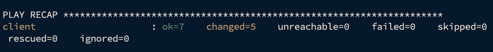

Подключаемся к клиенту

```
vagrant ssh client
```
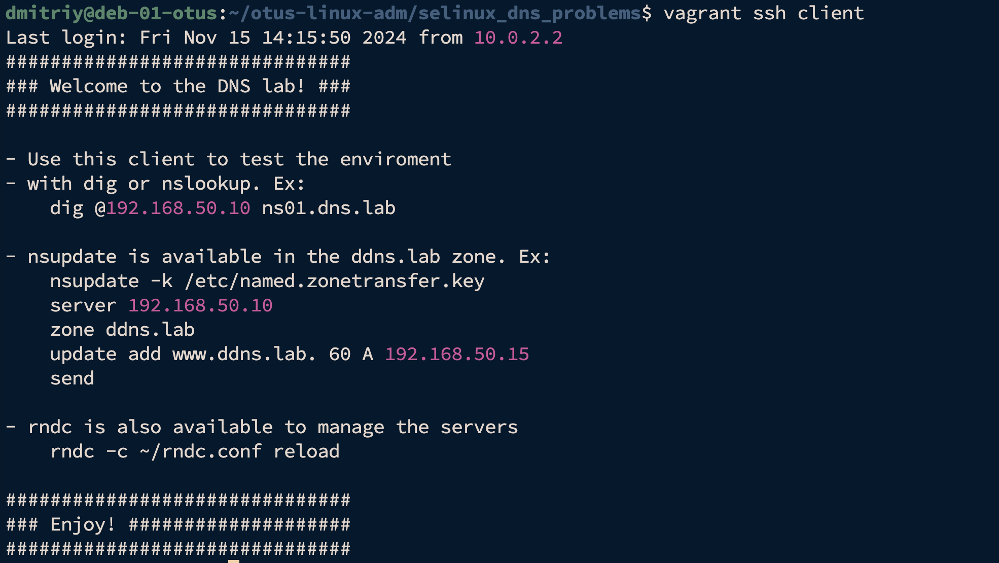

Пробуем внести изменения в зону

```
nsupdate -k /etc/named.zonetransfer.key
```

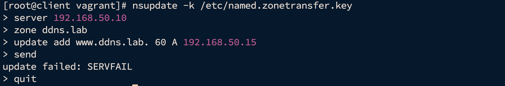

Посмотрим логи SELinux. Для этого воспользуемся утилитой audit2why

```
cat /var/log/audit/audit.log | audit2why
```


Ошибки отсутствуют

Не закрывая сессию на клиенте, подключимся к серверу ns01 и проверим логи SELinux
```
cat /var/log/audit/audit.log | audit2why
```

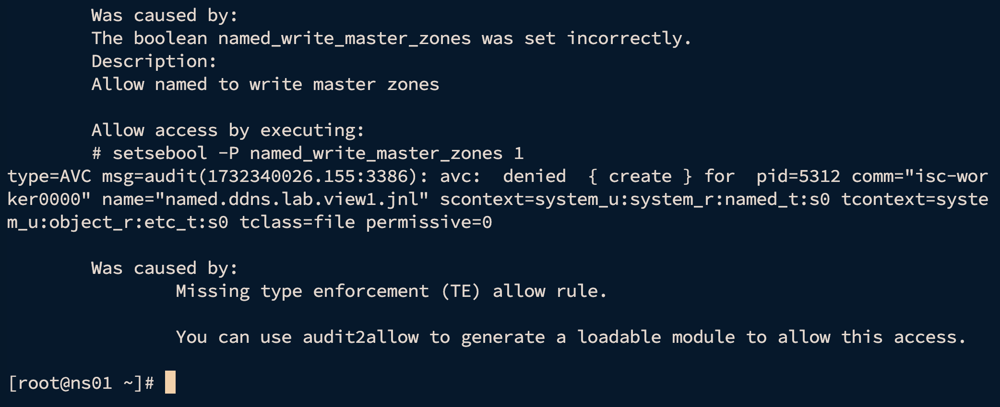

В логах мы видим, что ошибка в контексте безопасности. Вместо типа named_t используется тип etc_t. Проверим данную проблему в каталоге /etc/named

Проверим проблему в каталоге /etc/named

```
ls -laZ /etc/named
```

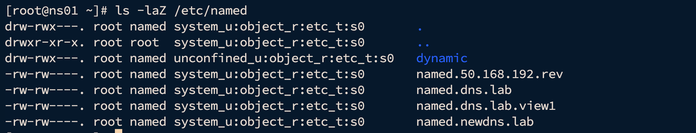

Контекст безопасности неправильный. Проблема заключается в том, что конфигурационные файлы лежат в другом каталоге. Посмотреть в каком каталоги должны лежать, файлы, чтобы на них распространялись правильные политики SELinux можно с помощью команды

```
sudo semanage fcontext -l | grep named
```
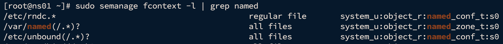

Изменим тип контекста безопасности для каталога /etc/named

```
sudo chcon -R -t named_zone_t /etc/named
```

Проверим

```
ls -laZ /etc/named
```

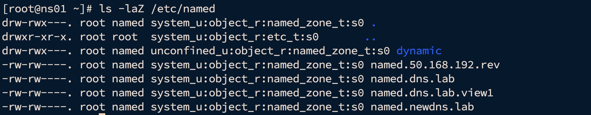

named_zone_t - Изменения применились. Снова вносим изменения на клиенте

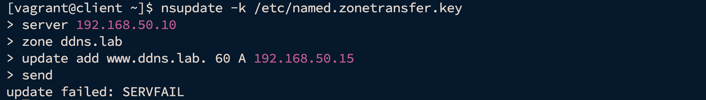

Ошибка. Смотрим лог на клиенте. Ошибок нет

Смотрим лог сервера:

```
cat /var/log/audit/audit.log | audit2why
```

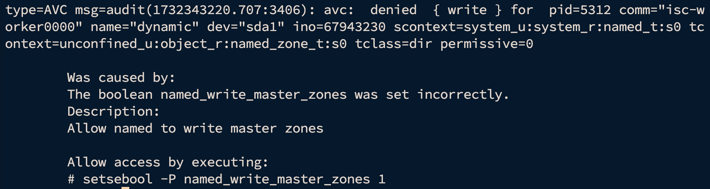

Требуется поменять параметр named_write_master_zones (выполнение команды займет время)

```
setsebool -P named_write_master_zones 1
```
Снова пробуем вносить изменения на клиенте

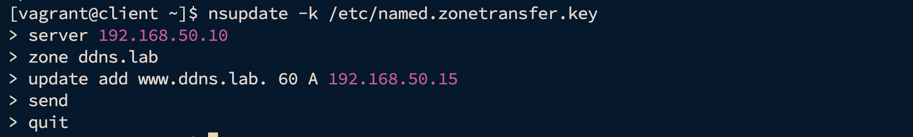

Прошло успешно. Проверим с помощью `dig`

```
dig www.ddns.lab
```

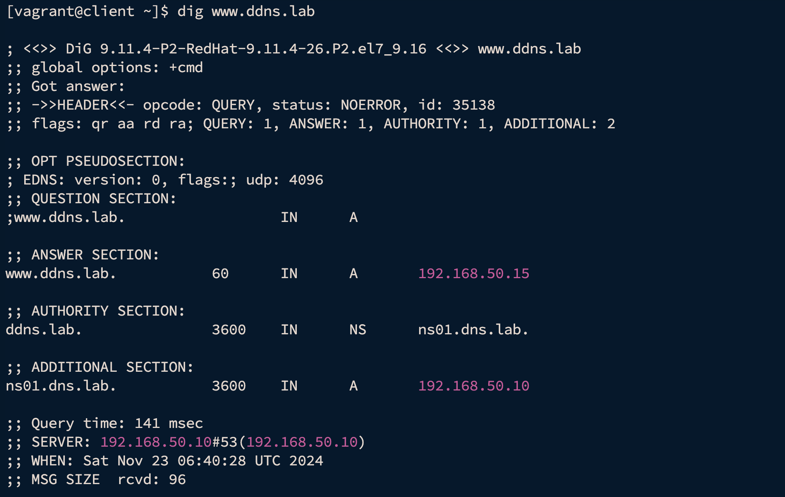

Изменения применились. Перезагрузим хосты и ещё раз сделаем запрос с помощью `dig`

```
dig @192.168.50.10 www.ddns.lab
```
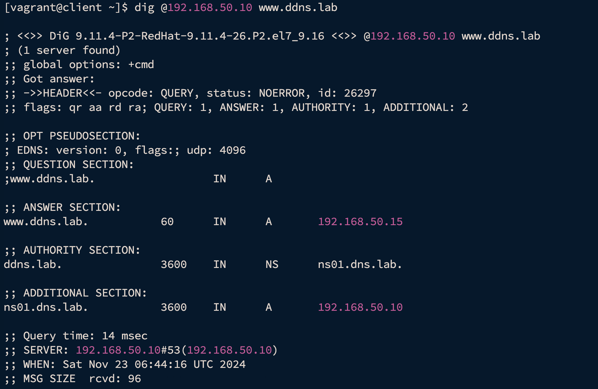

После перезагрузки настройки сохранились. Для того, чтобы вернуть правила обратно, можно ввести команду: restorecon -v -R /etc/named