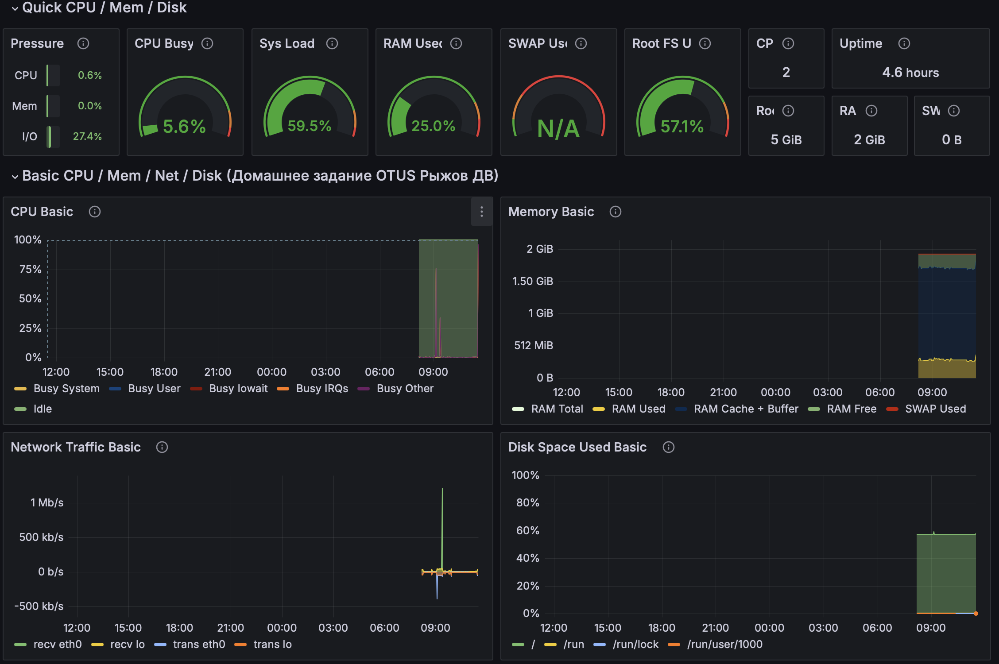

# Домашнее задание Настройка мониторинга

## Настройка дашборда с 4-мя графиками

Реализовано в Yandex Cloud (для проверки потребуется настроенный `cli`)

Для создания тестовой виртуальной машины использовать скрипт
```
./vm-test-up.sh
```

В качестве систем выбберем связку prometheus - grafana

Для установки необходимых компонент и настроике нужно из папки `hw` запустить ansible-playbook
```
ansible-playbook setup_monitoring_grafana.yml
```

После успешного выполнения плейбука дальнейшие настройки дашборда ведутся через веб-интерфейс grafana. Для этого нужно перейти по адресу http://<IP_VM>:3000

Далее через меню `Data sources` добавить источник данных `Prometeus` и создать дашборд с необходимымой информацией.

Результат представлен на скриншоте ниже:



После проверки задания виртуальную машину можно удалить с помощью

```
./vm-test-down.sh
```