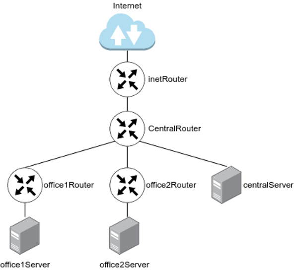

# Домашнее задание "Разворачиваем сетевую лабораторию"

## Планируемая архитектура
построить следующую архитектуру



Сеть office1
- 192.168.2.0/26      - dev
- 192.168.2.64/26    - test servers
- 192.168.2.128/26  - managers
- 192.168.2.192/26  - office hardware

Сеть office2
- 192.168.1.0/25      - dev
- 192.168.1.128/26  - test servers
- 192.168.1.192/26  - office hardware


Сеть central
- 192.168.0.0/28    - directors
- 192.168.0.32/28  - office hardware
- 192.168.0.64/26  - wifi

```
Office1 ---\
      -----> Central --IRouter --> internet
Office2----/
```
Итого должны получится следующие сервера
- inetRouter
- centralRouter
- office1Router
- office2Router
- centralServer
- office1Server
- office2Server

## Теоретическая часть

### Найти свободные подсети

Office1: Нет свободных подсетей (вся сеть 192.168.2.0/24 разделена на 4 подсети /26).

Office2: Нет свободных подсетей (вся сеть 192.168.1.0/24 разделена на 3 подсети).

Central:

Свободные диапазоны:

- 192.168.0.16/28 (16 адресов)
- 192.168.0.48/28 (16 адресов)
- 192.168.0.128/25 (128 адресов).

### Посчитать сколько узлов в каждой подсети, включая свободные

Для удобства воспользуемся инструментом `ipcalc`

|Подсеть|Маска|Всего адресов|Доступные узлы|Broadcast|
|-------|-----|-------------|--------------|---------|
|Office1|||||
|192.168.2.0/26|/26|64|62|192.168.2.63|
|192.168.2.64/26|/26|64|62|192.168.2.127|
|192.168.2.128/26|/26|64|62|192.168.2.191|
|192.168.2.192/26|/26|64|62|192.168.2.255|
|Office2|||||
|192.168.1.0/25|/25|128|126|192.168.1.127|
|192.168.1.128/26|/26|64|62|192.168.1.191|
|192.168.1.192/26|/26|64|62|192.168.1.255|
|Central|||||
|192.168.0.0/28|/28|16|14|192.168.0.15|
|192.168.0.32/28|/28|16|14|192.168.0.47|
|192.168.0.64/26|/26|64|62|192.168.0.127|


### Указать broadcast адрес для каждой подсети

### проверить нет ли ошибок при разбиении

## Практическая часть
- Соединить офисы в сеть согласно схеме и настроить роутинг
- Все сервера и роутеры должны ходить в инет черз inetRouter
- Все сервера должны видеть друг друга
- у всех новых серверов отключить дефолт на нат (eth0), который вагрант поднимает для связи
- при нехватке сетевых интервейсов добавить по несколько адресов на интерфейс