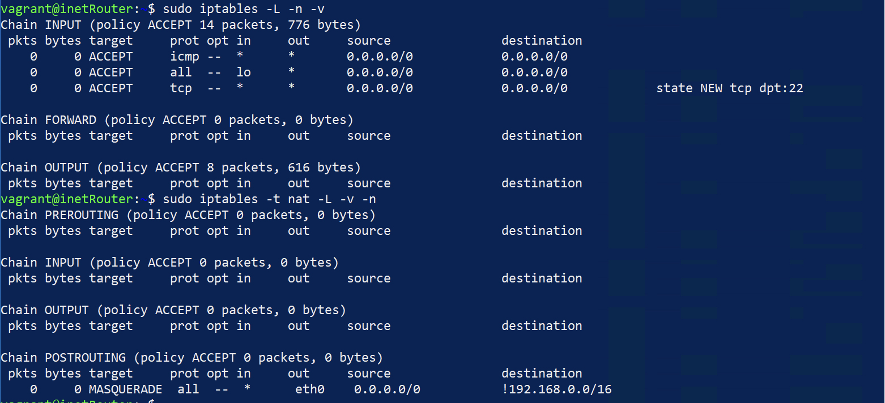

# Домашнее задание "Разворачиваем сетевую лабораторию"

## Планируемая архитектура
построить следующую архитектуру


Сеть office1
- 192.168.2.0/26      - dev
- 192.168.2.64/26    - test servers
- 192.168.2.128/26  - managers
- 192.168.2.192/26  - office hardware

Сеть office2
- 192.168.1.0/25      - dev
- 192.168.1.128/26  - test servers
- 192.168.1.192/26  - office hardware


Сеть central
- 192.168.0.0/28    - directors
- 192.168.0.32/28  - office hardware
- 192.168.0.64/26  - wifi

```
Office1 ---\
      -----> Central --IRouter --> internet
Office2----/
```
Итого должны получится следующие сервера
- inetRouter
- centralRouter
- office1Router
- office2Router
- centralServer
- office1Server
- office2Server

## Теоретическая часть

### Найти свободные подсети

Office1: Нет свободных подсетей (вся сеть 192.168.2.0/24 разделена на 4 подсети /26).

Office2: Нет свободных подсетей (вся сеть 192.168.1.0/24 разделена на 3 подсети).

Central:

Свободные диапазоны:

- 192.168.0.16/28 (16 адресов)
- 192.168.0.48/28 (16 адресов)
- 192.168.0.128/25 (128 адресов).

### Посчитать сколько узлов в каждой подсети, включая свободные

Для удобства воспользуемся инструментом `ipcalc`

|Подсеть|Маска|Всего адресов|Доступные узлы|Broadcast|
|-------|-----|-------------|--------------|---------|
|Office1|||||
|192.168.2.0/26|/26|64|62|192.168.2.63|
|192.168.2.64/26|/26|64|62|192.168.2.127|
|192.168.2.128/26|/26|64|62|192.168.2.191|
|192.168.2.192/26|/26|64|62|192.168.2.255|
|Office2|||||
|192.168.1.0/25|/25|128|126|192.168.1.127|
|192.168.1.128/26|/26|64|62|192.168.1.191|
|192.168.1.192/26|/26|64|62|192.168.1.255|
|Central|||||
|192.168.0.0/28|/28|16|14|192.168.0.15|
|192.168.0.32/28|/28|16|14|192.168.0.47|
|192.168.0.64/26|/26|64|62|192.168.0.127|


### Указать broadcast адрес для каждой подсети
broadcast адрес для каждой подсети указан в таблице выше

### проверить нет ли ошибок при разбиении
Как видим ошибок при разбиении и наложении сетей нет

## Практическая часть

### Создание стенда

Стенд создадим с помощью Virtualbox. Vagrantfile нужной конфигурацией в папке с домашним заданием.

```bash
vagrant up
```

После успешного выполнения видим, что необходимые виртуальные машины созданы.


### Настройка NAT

Для того, чтобы на всех серверах работал интернет через inetRouter на самом inetRouter нужно настроить NAT.

```bash
vagrant ssh inetRouter
```

Проверим работает ли фаерволл:

```bash
sudo systemctl status ufw
```


Отключим и удалим из автозагрузки

```bash
sudo systemctl stop ufw && sudo systemctl disable ufw
```

Установим iptables

```sh
sudo apt install iptables
```

Создаем файл с правилами iptables

```bash
vi /etc/iptables_rules.ipv4
```

файл содержит следуюущую конфигурацию (комментариии по тексту)

```bash
# Начало раздела фильтрации пакетов (основные правила брандмауэра)
*filter
# Цепочка INPUT (входящий трафик) имеет политику ACCEPT по умолчанию. [0:0] — нет обработанных пакетов.
:INPUT ACCEPT [0:0]
# Цепочка FORWARD (транзитный трафик) имеет политику ACCEPT. [0:0] — нет обработанных пакетов.
:FORWARD ACCEPT [0:0]
# Цепочка OUTPUT (исходящий трафик) имеет политику ACCEPT. [0:0] — нет обработанных пакетов.
:OUTPUT ACCEPT [0:0]
# Разрешить все входящие ICMP-пакеты
-A INPUT -p icmp -j ACCEPT
# Разрешить весь трафик на интерфейсе lo
-A INPUT -i lo -j ACCEPT
# Разрешить новые (--state NEW) TCP-подключения на порт 22 (SSH)
-A INPUT -p tcp -m state --state NEW -m tcp --dport 22 -j ACCEPT
# Применить все правила секции filter
COMMIT
# Начало раздела NAT
*nat
# Цепочка PREROUTING (изменение пакетов до маршрутизации) — политика ACCEPT.
:PREROUTING ACCEPT [0:0]
# Цепочка INPUT в NAT — политика ACCEPT.
:INPUT ACCEPT [0:0]
# Цепочка OUTPUT в NAT — политика ACCEPT.
:OUTPUT ACCEPT [0:0]
# Цепочка POSTROUTING (изменение пакетов после маршрутизации) — политика ACCEPT.
:POSTROUTING ACCEPT [0:0]
# Правило для MASQUERADE Для всех пакетов, которые: не направлены в сеть 192.168.0.0/16 (! -d), выходят через интерфейс eth0 (-o eth0), применить маскарадинг (MASQUERADE).
-A POSTROUTING ! -d 192.168.0.0/16 -o eth0 -j MASQUERADE
# Применить все правила секции nat.
COMMIT
```

Создаём файл, в который добавим скрипт автоматического восстановления правил при перезапуске системы:

```sh
vi /etc/network/if-pre-up.d/iptables
```

содержимое файла

```sh
#!/bin/sh
/sbin/iptables-restore < /etc/iptables_rules.ipv4
```

Добавляем права на выполнение файла `/etc/network/if-pre-up.d/iptables`

```sh
sudo chmod +x /etc/network/if-pre-up.d/iptables
```

Перезагружаем сервер и после перезагрузки сервера проверяем правила iptables в таблице NAT

```sh
iptables -t nat -L -v -n
```


также можно проверить с помощью

```sh
iptables-save
```

### Настройка IP forward

IP Forwarding (перенаправление IP-пакетов) — это функция ядра Linux, которая позволяет компьютеру работать как маршрутизатор, пересылая сетевые пакеты между интерфейсами. В нашей схеме необходимо включить данную маршрутизацию на всех роутерах. По умолчанию эта функция отключена в Linux. Включить её можно командой: 

```sh
echo "net.ipv4.conf.all.forwarding = 1" | sudo tee -a /etc/sysctl.conf && sudo sysctl -p
```

Проверить можно с помощью команды

```sh
sysctl net.ipv4.conf.all.forwarding
```

Вывод должен быть `net.ipv4.conf.all.forwarding = 1`

### Отключение маршрута по умолчанию на интерфейсе eth0

При разворачивании стенда Vagrant создает в каждом сервере свой интерфейс, через который у сервера появляется доступ в интернет. Отключить данный порт нельзя, так как через него Vagrant подключается к серверам. Обычно маршрут по умолчанию прописан как раз на этот интерфейс, данный маршрут нужно отключить:


Для отключения маршрута по умолчанию в файле /etc/netplan/00-installer-config.yaml добавляем отключение маршрутов, полученных через DHCP:

```yaml
# This is the network config written by 'subiquity'
network:
  ethernets:
    eth0:
      dhcp4: true
      dhcp4-overrides:
          use-routes: false
      dhcp6: false
  version: 2
```

После внесения данных изменений перезапускаем сетевую службу: 

```sh
netplan try
```

Отключение дефолтного маршрута настроим на всех хостах кроме inetRouter


Проверить корректность YAML-файлов можно с помощью `yamllint` — специализированный инструмент для проверки синтаксиса и стиля YAML.

```sh
sudo apt update && sudo apt install yamllint
```

Проверить файл можно будет с помощью комманды

```sh
yamllint file.yaml
```

### Настройка статических маршрутов

Команда ip route используется для управления таблицей маршрутизации в Linux. Она позволяет добавлять, удалять, изменять и просматривать маршруты.

Просмотр текущих маршрутов

```sh
ip route show
```

или 

```sh
ip route
```

Чтобы добавить маршрут в интернет через шлюз inetRouter необходимо выполнеить комманду

```sh
sudo ip route add 0.0.0.0/0 via 192.168.255.1
```

Для проверки использования маршрута используем комманду `traceroute` (возможно потребуется установка)

```sh
apt install traceroute
```

После назначения маршрута проверим, что он используется

```sh
traceroute ya.ru
```


Видим, что пакет для адреса 77.88.55.242 вначале попадает на шлюз inetRouter, затем на гипервизор 10.0.2.2 и потом уже уходит в интернет.

Аналогичным образом настраиваются маршруты до других хостов или подсетей в нашем стенде.

Маршруты, добавленные через ip route, сбрасываются после перезагрузки. Чтобы сохранить их, в Debian/Ubuntu необходимо добавить их в `/etc/network/interfaces`
