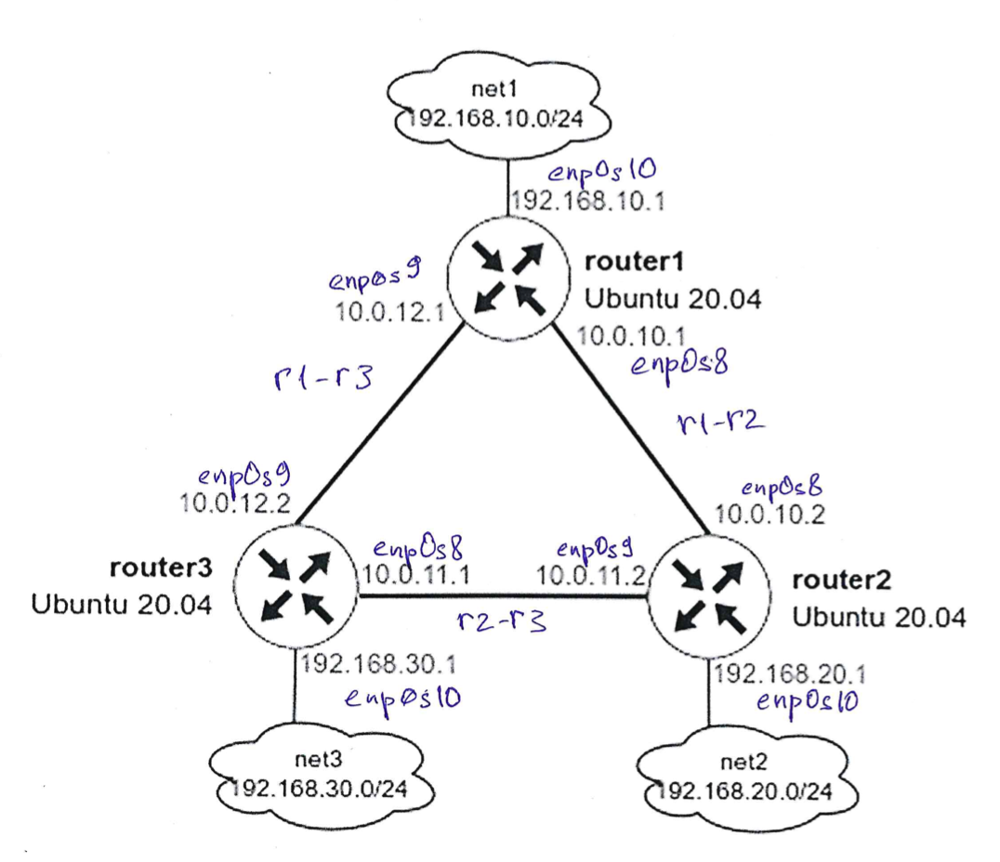

# Домашнее задание OSPF

Цель: Научится настраивать протокол OSPF в Linux-based системах.

Что нужно сделать:
- поднять три виртуальных машины;
- объединить их разными vlan;
- поднять OSPF между машинами на базе Quagga;
- изобразить ассиметричный роутинг;
- сделать один из линков "дорогим", но что бы при этом роутинг был симметричным.

## Создание тестового стенда

```bash
vagrant up
```

Создадим тестовый стенд из трех виртуальных машин. Стенд будет иметь сетевую структуру указанную на рисунке:



Кроме того, каждая машина стенда будет иметь сервисный порт для управления с помощью `ansible`.

После создания каждой виртуальной машины будет выполнен `ansible-playbook provision.yml`, который произведет установку необзодимых пакетов для работы и тестировани OSPF.

Когда создание и настройка виртуальных машин будет завершена можно проверить работу OSPF.

## Настройка OSPF между машинами на базе FRR

После создания тестового стенда и выполнение `ansible-playbook provision.yml` мы получаем полностью настроенный OSPF.

С любого хоста нам должны быть доступны сети:
- 192.168.10.0/24
- 192.168.20.0/24
- 192.168.30.0/24
- 10.0.10.0/30 
- 10.0.11.0/30
- 10.0.13.0/30

Проверить можно утилитой `ping` зайдя на любую ВМ с помощью `vagrant ssh`. Также отключив один из интерфейсов между ВМ убедиться с помощью `traceroute` что маршрут меняется, но сетевая связанность не пропадает.

# Настройка ассиметричного роутинга

Для настройки ассиметричного роутинга нам необходимо выключить блокировку ассиметричной маршрутизации: sysctl net.ipv4.conf.all.rp_filter=0

Через CLI это делается с помощью комманд (пример для интерфейса enp0s9):
```bash
vtysh
conf t
int enp0s0
ip ospf cost 1000
exit
exit
```
После внесенных изменений обратный трафик пойдет по другому пути.

# Настройка симметичного роутинга

Если настройки ассиметричного роутинга мы делали для `router1`, то проведя аналогичные действия по "удорожанию" интерфейса `enp0s9` для `router3` мы получим реализацию симметричного роутинга. 