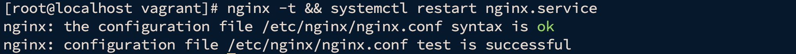
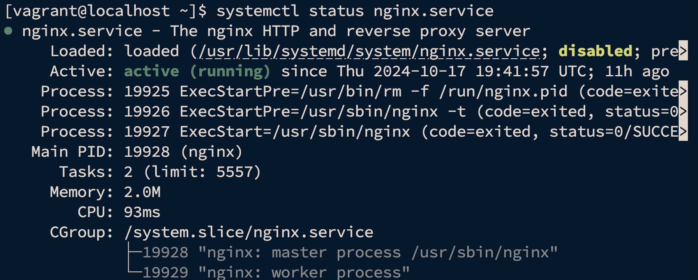
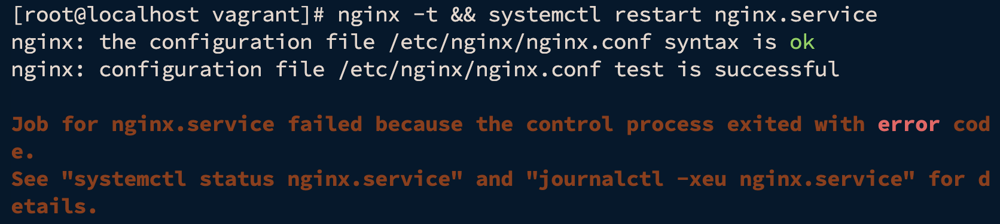

# Практика с SELinux. Домашнее задание

## Задание 1. Запустить nginx на нестандартном порту 3-мя разными способами

Для выполнения задания будем использовать almalinux/9 версии 9.4.20240805

```bash
vagrant init almalinux/9 --box-version 9.4.20240805
```

```bash
vagrant up
```

```bash
vagrant ssh
```

Действия выполняем под root

```bash
sudo su
```

Для работы с SElinux Установим необходимые пакеты

```bash
yum install -y setroubleshoot-server selinux-policy-mls setools-console policycoreutils-newrole policycoreutils-python-utils
```

```bash
dnf -y install setroubleshoot-server
```

Для выполнения задания установим nginx

```bash
yum install -y nginx
```

Проверим режим работы SELinux

```bash
getenforce
```



### Способ 1. Переключатели setsebool

После установки проверим файл настроек и запустим nginx

```bash
nginx -t && systemctl start nginx.service
```

Убедимся что nginx запустился

```bash
systemctl status nginx.service
```



Изменим порт и отключим IPv6

```bash
vi /etc/nginx/nginx.conf
```


Проверим файл настроек и перезапустим nginx

```bash
nginx -t && systemctl restart nginx.service
```



Настройки корректны, но nginx не запустился

Находим в логах (/var/log/audit/audit.log) информацию о блокировании порта

### Способ 2. добавление нестандартного порта в имеющийся тип


### Способ 3. формирование и установка модуля SELinux.


К сдаче:
README с описанием каждого решения (скриншоты и демонстрация приветствуются).

2. Обеспечить работоспособность приложения при включенном selinux.
развернуть приложенный стенд https://github.com/mbfx/otus-linux-adm/tree/master/selinux_dns_problems;
выяснить причину неработоспособности механизма обновления зоны (см. README);
предложить решение (или решения) для данной проблемы;
выбрать одно из решений для реализации, предварительно обосновав выбор;
реализовать выбранное решение и продемонстрировать его работоспособность.